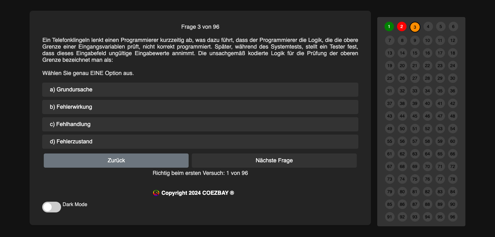
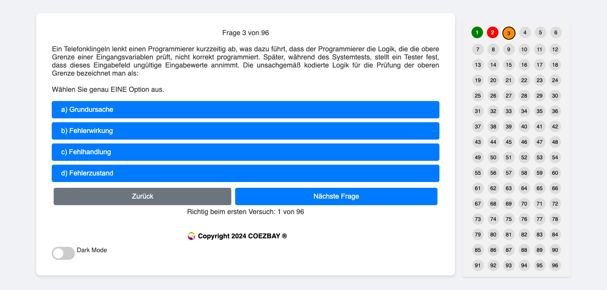

# TestPrepWeb Projekt




## Über das Projekt

Dieses Projekt ist ein Online-Quiz, das mit HTML, CSS und JavaScript erstellt wurde. Es zielt darauf ab, Benutzern eine
ansprechende und interaktive Möglichkeit zu bieten, ihr Wissen in verschiedenen Themenbereichen zu testen und zu
erweitern.
Nutzer können die `jsonschema.json` in ihre IDE integrieren, um individuelle Fragen und Antworten in der `fragen.json`
zu implementieren und zu validieren. Dies hilft, Fehler bei selbst erstellten Fragen und Antworten zu vermeiden.

## Aktueller Stand

### Erledigte Punkte

- **Grundstruktur des Quiz**: Die Basisstruktur des Quiz mit Fragen, Antwortmöglichkeiten und Navigationsbuttons ("
  Zurück" und "Nächste Frage") ist implementiert.
- **Stylesheet-Optimierungen**: Verbesserungen in der `styles.css` für eine konsistente und ansprechende
  Benutzeroberfläche.
- **Dynamische Frageanzeige**: Fragen und Antworten werden dynamisch aus einer JSON-Datei geladen.
- **Feedback-Farbanzeige**: Die Anzeige des Feedbacks erfolgt mit einem grauen Hintergrund.
- **Verbesserung der Feedback-Anzeige**: Implementierung einer Farbkodierung für das Feedback (grün für korrekte
  Antworten, rot für falsche Antworten) und Anpassung der Schriftfarbe entsprechend.
- **Mittige Ausrichtung des Feedback-Hintergrunds**: Korrektur der Ausrichtung, sodass der Feedback-Hintergrund mittig
  und konsistent mit dem Layout der Fragen und Antworten ist.
- **Anzeige der Leistung beim ersten Versuch**: Hinzufügen einer Funktionalität zur Anzeige der Anzahl der beim ersten
  Versuch richtig beantworteten Fragen.
- **Blocksatz für Fragestellungen**: Fragen werden nun in Blocksatz angezeigt, um eine verbesserte Lesbarkeit zu bieten.
- **Tabellen**: Möglichkeit zur Erstellung von Tabellen implementiert (Kopf + Körper) & (Nur Körper) & (Kopf + Körper +
  Kopf + Körper). Visuell: Zebrastreifen für Trennung der Zeilen.
- **Übersicht Fortschritt-Map**: Eine Übersicht der abgearbeiteten Aufgaben implementieren, wobei die richtig und falsch
  bearbeiteten Aufgaben farblich (rot/grün) markiert werden sollen. Es soll dann auch möglich sein, einzelne Punkte
  dieser Übersicht anzuklicken, um die Aufgabenstellung zu jedem Zeitpunkt direkt zu betrachten.
- **Bilder für Aufgabenstellung**: Es soll möglich sein, Bilder für die Aufgabenstellung zu verwenden.
- **Indikator für aktive Aufgabe**: Aktive/Angezeigte Aufgabe in der Map markieren.
- **Dark Mode einbauen**: Dark Mode für die Schonung der Augen.

### Noch zu erledigen

- **Anpassung der Button-Positionen**: Sicherstellen, dass die "Zurück" und "Nächste Frage" Buttons unabhängig von der
  Textlänge der Frage oder den Antwortmöglichkeiten statisch bleiben.
- **Tests schreiben**: Gründlich testen und sicherstellen, dass TestPrepWeb über verschiedene Browser und Endgeräte
  hinweg konsistent funktioniert.
- **Trennung der Probeprüfungen nach Realisierungszeitraum**: Probeprüfungen nach Realisierungszeitraum trennen und ein
  Auswahlmenü beim Start der Anwendung implementieren.
- **Anleitung jsonschema.json**: Anleitung zur Nutzung der jsonschema.json schreiben. Für IDE's und IDE-unabhängig
- **Einsicht anderer Antwortmöglichkeiten**: Nachdem beispielsweise bei den ISTQB® Prüfungen, Inhalte aus dem Glossar
  und dem Lehrplan eingepflegt wurden, können auch die fehlerhaften Antwortmöglichkeiten einen Mehrwert für die
  Lernenden bieten. Diese Möglichkeit sollte auch bei anderen Tests in Betracht gezogen werden.

## Geplante Features

- **Responsive Design**: Optimierung der Quiz-Anwendung für verschiedene Bildschirmgrößen und Geräte.
- **Sprachen**: Anwendung multilingual zur Verfügung stellen
- **Individualisierbare Themes**: Selbsterklärend
- **Import-Möglichkeiten**: Frage und Antworten (Im Best-Case - Schema unabhängig)
- **Benutzerdefinierte Quiz-Module**: Benutzern ermöglichen ihre eigenen Quiz-Module basierend auf spezifischen Themen oder Schwierigkeitsgraden zusammenzustellen.
- **Speichern und Fortfahren**: Funktion, mit der Benutzer ihren Fortschritt speichern und zu einem späteren Zeitpunkt wieder aufnehmen können.
- **Detaillierte Statistiken**: Detaillierte Statistiken über die Leistung des Benutzers, einschließlich Bereichen, in denen sie gut abschneiden, und Bereichen, die Verbesserung erfordern.
- **Anpassbare Berichte**: Benutzern, die Erstellung von anpassbaren Berichten über ihre Leistung und Fortschritte zu erstellen und zu exportieren.

## Zugänglichkeit und Inklusion
- **Barrierefreiheitsoptionen**: Sicher stellen, dass die Anwendung für Benutzer mit verschiedenen Behinderungen zugänglich ist, z.B. durch Sprachausgabe oder leicht verständliche Bedienelemente.

## Kontinuierliche Entwicklung

- **Erweiterung des Fragenkatalogs**: Hinzufügen weiterer Fragen und Themenbereiche zum Quiz.

## Beitrag

- **Feedback und Zusammenarbeit**: Feedback und Beiträge sind willkommen! Fühlen Sie sich frei, Issues zu öffnen oder
  Pull Requests für vorgeschlagene Verbesserungen zu erstellen.

## Anerkennung externer Quellen

Ein Teil der in dieser Repo verwendeten Fragen und Antworten basiert auf Materialien des ISTQB® (International Software
Testing Qualifications Board).
Diese Materialien werden unter Anerkennung des ISTQB® als Quelle und Copyright-Inhaber gemäß ihrer Richtlinien
verwendet.

Ich danke dem ISTQB® für die Bereitstellung dieser Ressourcen und erkenne ihre Urheberschaft vollständig an.

Des Weiteren erkenne ich den Beitrag der Autoren und der an der Lokalisierung und Überprüfung der Aktualisierungen
Beteiligten an. Für die Aktualisierung 2018 v3.1 bestand das Team aus Klaus Olsen (Leitung), Meile Posthuma und
Stephanie Ulrich als Autoren. An der Lokalisierung und Überprüfung der Übersetzung der Aktualisierungen wirkten Arne
Becher, Ralf Bongard, Milena Donato, Dr. Matthias Hamburg, Andreas Hetz, Tobias Horn, Karl Kemminger, Martin Klonk,
Nishan Portoyan, Horst Pohlmann und Stephanie Ulrich (Leitung) mit. Für die Aktualisierungen 2018 wurde das Team durch
Tauhida Parveen (stellvertretende Leitung), Rex Black (Projektmanager), Debra Friedenberg, Matthias Hamburg, Judy McKay,
Hans Schaefer, Radoslaw Smilgin, Mike Smith, Steve Toms, Marie Walsh und Eshraka Zakaria ergänzt, mit zusätzlicher
Unterstützung bei Lokalisierung und Überprüfung von Alisha Bülow et al., Dr. Klaudia Dussa-Zieger, Elke Mai, Atilim
Siegmund, Prof. Dr. Andreas Spillner (i.R.), Sabine Uhde und erneut Stephanie Ulrich (Leitung). Die Aktualisierungen für
2011 wurden von Thomas Müller, Debra Friedenberg und der ISTQB®-Arbeitsgruppe Foundation Level geleitet, die
Aktualisierungen für 2010 von Thomas Müller, Armin Beer, Martin Klonk und Rahul Verma.

Ich danke allen Beteiligten, die all diese Informationen frei zugänglich für die Welt zur Verfügung stellen.

## Lokale Ausführung von TestPrepWeb

TestPrepWeb ist eine einfache Webanwendung, die aus HTML-, CSS- und JavaScript-Dateien besteht. Um TestPrepWeb lokal auf
deinem Computer auszuführen, sind keine speziellen Webserver oder Umgebungen erforderlich. Folge diesen Schritten, um
das Quiz lokal zu starten:

1. **Klone das Git-Repository** oder lade die Projektdateien herunter:

- Git-Repository klonen (falls Git installiert ist):
  ```
  git clone https://github.com/coezbay/TestPrepWeb.git
  ```
- Oder lade die Projektdateien als ZIP-Archiv von der GitHub-Seite herunter und entpacke sie.

2. **Öffne das Projekt in einem Editor:**

- Öffne den Projektordner in einem Code-Editor deiner Wahl (z.B. IntelliJ, Visual Studio, Visual Studio Code, Sublime
  Text, Atom usw.).

3. **Öffne die `index.html`-Datei in einem Webbrowser:**

- Navigiere im Projektordner zur `index.html`-Datei.
- Öffne die `index.html`-Datei mit einem Webbrowser deiner Wahl (z.B. Google Chrome, Firefox, Safari).

4. **Bearbeite die Quizfragen und Antworten:**

- Bearbeite die `fragen.json`-Datei, um eigene Fragen und Antworten hinzuzufügen oder bestehende zu ändern.
- Verwende die `jsonschema.json`, um die Struktur deiner Fragen und Antworten zu validieren.

Durch diese Schritte kannst du das Quiz sofort auf deinem lokalen Computer ausführen und testen. Änderungen an den
Dateien (HTML, CSS, JavaScript, JSON) werden nach dem Neuladen der Seite im Browser sichtbar.

## Entwicklungs-Server

Für eine fortgeschrittene Entwicklung oder wenn du Features wie Live-Reload nutzen möchtest, kannst du einen einfachen
Entwicklungs-Server verwenden. Hier sind einige Optionen:

- **Visual Studio Code Live Server:**
    - Installiere die Live Server Extension in Visual Studio Code.
    - Rechtsklicke auf die `index.html`-Datei und wähle "Open with Live Server".

- **Verwende einen einfachen HTTP-Server:**
    - Installiere Node.js und npm auf deinem Computer.
    - Installiere http-server global mit npm:
      ```
      npm install -g http-server
      ```
    - Navigiere im Terminal oder Command Prompt zum Projektordner und starte den Server mit:
      ```
      http-server
      ```
    - Öffne die angezeigte URL im Browser.

Diese Tools ermöglichen es dir, Änderungen am Code in Echtzeit im Browser zu sehen, ohne manuell neu laden zu müssen.

## Lizenz

Dieses Projekt ist unter der [MIT-Lizenz](LICENSE.txt) veröffentlicht.

## Sprachen

- [English](README.md)
- [Deutsch](README_DE.md)
- [Français](README_FR.md)