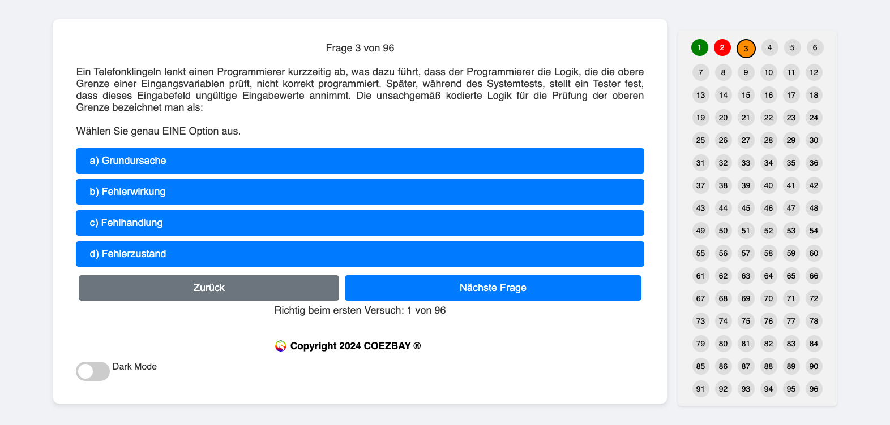

# TestPrepWeb Projet




## À propos du projet

Ce projet est un quiz en ligne créé avec HTML, CSS et JavaScript. Il vise à offrir aux utilisateurs une manière
engageante et interactive de tester et d'étendre leurs connaissances dans divers domaines. Les utilisateurs peuvent
intégrer le `jsonschema.json` dans leur IDE pour implémenter et valider des questions et réponses individuelles dans
le `fragen.json`. Cela aide à éviter les erreurs dans les questions et réponses créées par eux-mêmes.

## État actuel

Testez simplement l'état actuel via ce [lien](https://coezbay.github.io/TestPrepWeb/).

### Points accomplis

- **Structure de base du quiz** : La structure de base du quiz avec des questions, des options de réponse et des boutons
  de navigation ("Retour" et "Question suivante") est implémentée.
- **Optimisations de la feuille de style** : Améliorations dans le `styles.css` pour une interface utilisateur cohérente
  et attrayante.
- **Affichage dynamique des questions** : Les questions et réponses sont chargées dynamiquement à partir d'un fichier
  JSON.
- **Affichage de la couleur de feedback** : L'affichage du feedback est réalisé avec un arrière-plan gris.
- **Amélioration de l'affichage du feedback** : Implémentation d'un codage couleur pour le feedback (vert pour les
  réponses correctes, rouge pour les réponses incorrectes) et ajustement de la couleur de la police en conséquence.
- **Alignement central de l'arrière-plan du feedback** : Correction de l'alignement pour que l'arrière-plan du feedback
  soit centré et cohérent avec la mise en page des questions et réponses.
- **Affichage des performances au premier essai** : Ajout d'une fonctionnalité pour afficher le nombre de questions
  répondues correctement au premier essai.
- **Justification des questions** : Les questions sont désormais affichées en justification pour améliorer la
  lisibilité.
- **Tableaux** : Implémentation de la possibilité de créer des tableaux (En-tête + Corps) & (Corps uniquement) & (
  En-tête + Corps + En-tête + Corps). Visuellement : utilisation de zébrures pour séparer les lignes.
- **Vue d'ensemble du progrès** : Implémentation d'une vue d'ensemble des tâches réalisées, avec une marque colorée (
  rouge/vert) pour les tâches traitées incorrectement ou correctement. Il devrait également être possible de
  sélectionner des points individuels de cette vue d'ensemble pour examiner la tâche à tout moment.
- **Images pour les questions** : Il devrait être possible d'utiliser des images pour les questions.
- **Indicateur de la question active** : Marquer la question active/affichée dans l'aperçu.
- **Mode sombre** : Intégration d'un mode sombre pour le confort des yeux.
- **Aperçu des autres options de réponse** : Après l'intégration des contenus du glossaire et du programme des examens
  ISTQB®, il est maintenant possible de montrer les options de réponse incorrectes, ce qui offre une valeur ajoutée pour
  les apprenants. Cette fonctionnalité devrait être envisagée pour d'autres tests également.

### À faire

- **Ajustement des positions des boutons** : Assurer que les boutons "Retour" et "Question suivante" restent statiques
  indépendamment de la longueur du texte de la question ou des options de réponse.
- **Écrire des tests** : Tester minutieusement et s'assurer que TestPrepWeb fonctionne de manière cohérente sur
  différents navigateurs et appareils.
- **Séparation des quiz par période de réalisation** : Séparer les quiz par période de réalisation et implémenter un
  menu de sélection au démarrage de l'application.

## Fonctionnalités prévues

- **Conception réactive** : Optimisation de l'application quiz pour différentes tailles d'écran et appareils.
- **Langues** : Rendre l'application disponible en plusieurs langues.
- **Thèmes personnalisables** : Explication auto-suffisante.
- **Options d'importation** : Permettre l'importation de questions et réponses (idéalement indépendantes du schéma).
- **Modules de quiz personnalisables** : Permettre aux utilisateurs de créer leurs propres modules de quiz basés sur des
  thèmes spécifiques ou des niveaux de difficulté.
- **Sauvegarder et continuer** : Fonction permettant aux utilisateurs de sauvegarder leur progression et de reprendre
  plus tard.
- **Statistiques détaillées** : Fournir des statistiques détaillées sur les performances des utilisateurs, y compris les
  domaines où ils excellent et ceux nécessitant des améliorations.
- **Rapports personnalisables** : Permettre aux utilisateurs de créer et d'exporter des rapports personnalisés sur leurs
  performances et leurs progrès.

## Développement continu

- **Extension du catalogue de questions** : Ajout de plus de questions et domaines au quiz.

## Contribution

- **Feedback et collaboration** : Les retours et contributions sont les bienvenus ! N'hésitez pas à ouvrir des issues ou
  à créer des pull requests pour des améliorations suggérées.

## Reconnaissance des sources externes

Une partie des questions et réponses utilisées dans ce dépôt est basée sur les matériaux de l'ISTQB® (International
Software Testing Qualifications Board). Ces matériaux sont utilisés en reconnaissant l'ISTQB® comme source et détenteur
du droit d'auteur conformément à leurs directives. Je remercie l'

ISTQB® pour la mise à disposition de ces ressources et reconnais pleinement leur paternité.

De plus, je reconnais la contribution des auteurs et de ceux impliqués dans la localisation et la révision des mises à
jour. Pour la mise à jour 2018 v3.1, l'équipe était dirigée par Klaus Olsen, avec Meile Posthuma et Stephanie Ulrich en
tant qu'auteurs. La localisation et la révision des mises à jour de traduction ont impliqué Arne Becher, Ralf Bongard,
Milena Donato, Dr. Matthias Hamburg, Andreas Hetz, Tobias Horn, Karl Kemminger, Martin Klonk, Nishan Portoyan, Horst
Pohlmann, et Stephanie Ulrich (chef de projet). Pour les mises à jour de 2018, l'équipe était complétée par Tauhida
Parveen (chef de projet adjointe), Rex Black (gestionnaire de projet), Debra Friedenberg, Matthias Hamburg, Judy McKay,
Hans Schaefer, Radoslaw Smilgin, Mike Smith, Steve Toms, Marie Walsh, et Eshraka Zakaria, avec un soutien supplémentaire
pour la localisation et la révision de Alisha Bülow et al., Dr. Klaudia Dussa-Zieger, Elke Mai, Atilim Siegmund, Prof.
Dr. Andreas Spillner (retraité), Sabine Uhde, et de nouveau, Stephanie Ulrich (chef de projet). Les mises à jour pour
2011 étaient dirigées par Thomas Müller, Debra Friedenberg, et le groupe de travail ISTQB® Foundation Level, avec les
mises à jour de 2010 dirigées par Thomas Müller, Armin Beer, Martin Klonk, et Rahul Verma.

Je remercie tous les participants qui mettent toutes ces informations librement à disposition du monde entier.

## Exécution locale de TestPrepWeb

TestPrepWeb est une application web simple composée de fichiers HTML, CSS et JavaScript. Pour exécuter TestPrepWeb
localement sur votre ordinateur, aucun serveur web spécial ou environnement spécifique n'est nécessaire. Suivez ces
étapes pour démarrer le quiz localement :

1. **Clonez le dépôt Git** ou téléchargez les fichiers du projet :

- Clonez le dépôt Git (si Git est installé) :
  ```
  git clone https://github.com/coezbay/TestPrepWeb.git
  ```
- Ou téléchargez les fichiers du projet sous forme d'archive ZIP depuis la page GitHub et décompressez-les.

2. **Ouvrez le projet dans un éditeur :**

- Ouvrez le dossier du projet dans un éditeur de code de votre choix (par exemple, IntelliJ, Visual Studio, Visual
  Studio Code, Sublime Text, Atom, etc.).

3. **Ouvrez le fichier `index.html` dans un navigateur web :**

- Naviguez jusqu'au fichier `index.html` dans le dossier du projet.
- Ouvrez le fichier `index.html` avec un navigateur web de votre choix (par exemple, Google Chrome, Firefox, Safari).

4. **Modifiez les questions et les réponses du quiz :**

- Modifiez le fichier `fragen.json` pour ajouter vos propres questions et réponses ou pour modifier celles existantes.
- Utilisez le fichier `jsonschema.json` pour valider la structure de vos questions et réponses.

En suivant ces étapes, vous pouvez immédiatement exécuter et tester le quiz sur votre ordinateur local. Les
modifications apportées aux fichiers (HTML, CSS, JavaScript, JSON) seront visibles après le rechargement de la page dans
le navigateur.

## Serveur de développement

Pour un développement plus avancé ou si vous souhaitez utiliser des fonctionnalités comme le rechargement en direct,
vous pouvez utiliser un serveur de développement simple. Voici quelques options :

- **Serveur Live de Visual Studio Code :**
    - Installez l'extension Live Server dans Visual Studio Code.
    - Faites un clic droit sur le fichier `index.html` et sélectionnez "Ouvrir avec Live Server".

- **Utilisez un serveur HTTP simple :**
    - Installez Node.js et npm sur votre ordinateur.
    - Installez http-server globalement avec npm :
      ```
      npm install -g http-server
      ```
    - Naviguez jusqu'au dossier du projet dans le terminal ou l'invite de commande et démarrez le serveur avec :
      ```
      http-server
      ```
    - Ouvrez l'URL affichée dans le navigateur.

Ces outils vous permettent de voir les modifications du code en temps réel dans le navigateur sans avoir à recharger
manuellement.

## Licence

Ce projet est publié sous la [licence MIT](LICENSE.txt).

## Langues

- [Anglais](README.md)
- [Allemand](README_DE.md)
- [Français](README_FR.md)